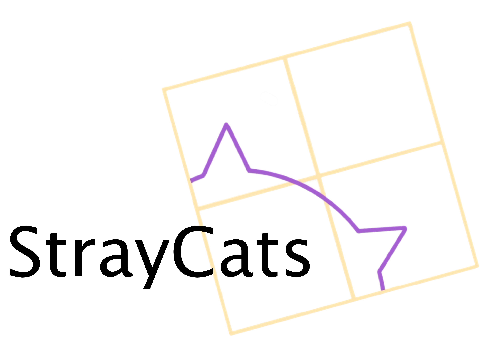

# StrayCats: The *NuSTAR* Straylight source Catalog

## Usage 

The StrayCats paper has been published into ApJ! Please use the [ADS entry for the paper](https://ui.adsabs.harvard.edu/abs/2021ApJ...909...30G/abstract) to find published version (which includes the FITS table provided here) and the arXiv preprint. If you find the StrayCats data useful, please cite our paper and/or get in touch!

## Science Papers that use stray light data:

### ["Measurement of the Absolute Crab Flux with NuSTAR"", Madsen et al. (2017)](https://ui.adsabs.harvard.edu/abs/2017ApJ...841...56M/abstract)

### ["StrayCats: A Catalog of NuSTAR Stray Light Observations", Grefenstette et al. (2021)](https://ui.adsabs.harvard.edu/abs/2021ApJ...909...30G/abstract)

### ["Extending the Baseline for SMC X-1's Spin and Orbital Behavior with NuSTAR Stray Light", Brumback et al. (2022)](https://ui.adsabs.harvard.edu/abs/2022ApJ...926..187B/abstract)

<!-- 
## Summer Undergraduate Research Fellowships based on stray light data:

["Analyzing Straylight X-ray Binaries with NuSTAR", Catherine Slaughter (2020)](pdfs/)

 -->

## Links

### An HTML version of the table can be found [here](tables/straycats_sorted_table) for all identified sources (sorted by the RA of the stray light source)

### An HTML version of the table can be found [here](tables/straycats_table) for all rows

### The current version of the FITS table can be found [here](tables/straycats.fits)

### An HTML version of the table for unidentified SL sources is [here](tables/straycats_table_unknowns)

### An HTML version of the table for Complex SL sources is [here](tables/straycats_table_complex)

## Sky distribution of SL sources

<iframe id="igraph" scrolling="no" style="border:none;" seamless="seamless" src="https://NuSTARStrayCats.github.io/straycats/plotly_figs/straycat_radec.html" height="540" width="960"></iframe>
--- 

## Galactic distribution of SL sources. Underlying image is the [ESO Milky Way panorama](https://www.eso.org/public/images/eso0932a/)
### Use the 'Zoom' tool to manipulate this image rather than the "Box Select" tool.
<iframe id="igraph" scrolling="no" style="border:none;" seamless="seamless" src="https://NuSTARStrayCats.github.io/straycats/plotly_figs/galaxy_overlay.html" height="540"  width="960"></iframe>

### The columns of the FITS file are:

1. StrayID:

    The Catalog identifier, which is StrayCatsI_XX where XX is the row number after the catalog is sorted the RA and Dec for the focused NuSTAR sequence ID.

2. Classification

   The classifications are:
   1. 'SL': Identified stray light source
   2. 'Complex': Multiple overlapping SL sources are present, difficult to analyze)
   3. 'Faint': Potential faint stray light
   4. 'GR': Ghost-rays from a source just outside of the FoV
   5. 'Unkn': Stray light from an unidentified source

3. SEQID

    The NuSTAR sequence ID
    
4. Module

    The NuSTAR FPM that contains the stray light (A or B)
    
5. Exposure

    The exposure time for this observation in seconds
    
6. Multi (FITS only)

    Whether the sequence ID contains multiple stray light patterns (Yes/No) 

7. Primary

    Primary Target

8. Time

    MJD time of the observation
    
9. RA / DEC of the Primary

10. SL Source

    If identified, otherwise ??
    
11. SL Type

    If we have identified the type of the object, this will be here
    
12. SIMAD_ID

    ID for the source in SIMBAD
    
13. RA/Dec of SL source

    If known. Otherwise -999
    
    
--- 

